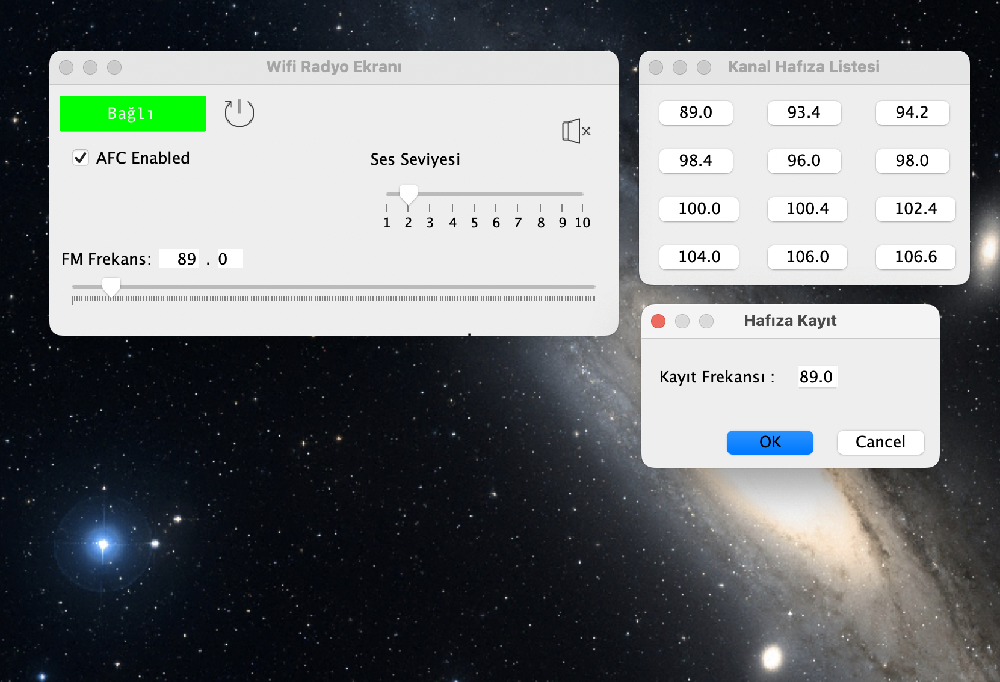
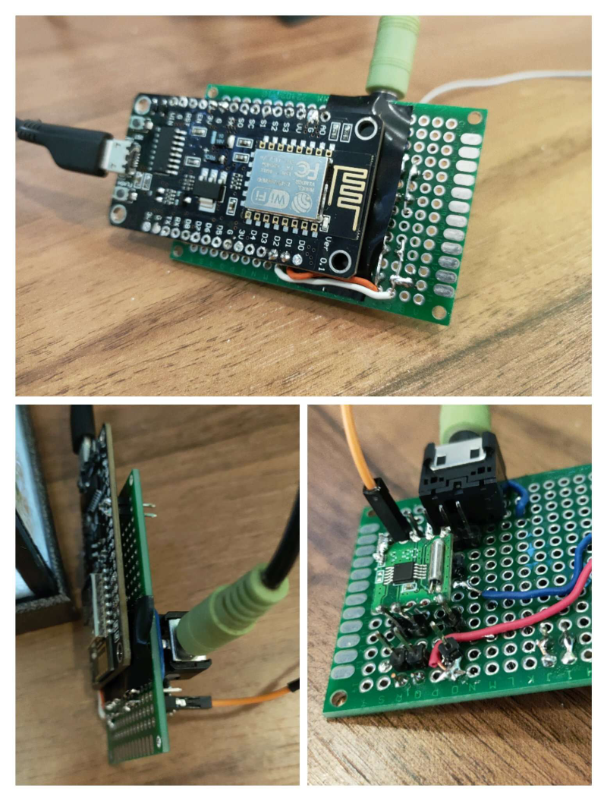
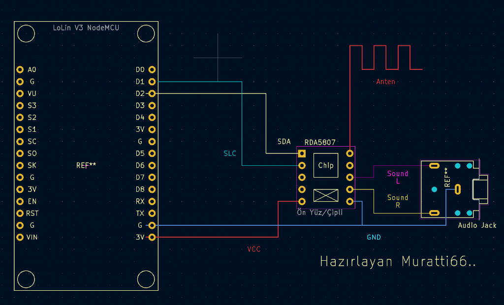

## Uzaktan Kontrol Edilen FM Radyo (Remote FM Radyo) Projesi

### Giriş
Bir çoğumuzun arabada yada cafede denkgelerek dinlediği ve nostalji olma adayı artık FM Radyo da dır. <br> 2000'li yıllardan kalma bir hayal için hobi olarak uğraştığım Arduino ve Componentlerini araştırırken uzaktan kontrol edilebilen bir radyo yapımı için gerekli altyapıyı tamamlayabileceğimi farkettim.<p>
Bunun üzerine bu projede paylaşacağım componentler ve yazılımlar ile WIFI üzerinden çalışan ve bilgisayar ile etkileşim ile kontrol edilebilen bir Radyo'yu tamamladım. <p>
Umarım faydalı olur.. ve sorular yada katkıda bulunmak isterseniz pull request üzerinden case açmaktan çekinmeyin.<p> 

### Proje Görüntüleri

<p>



### Genel Özellikler
* Basit, kolay ve kestirmelerle pratik hale getirilmiş bir arayüz kullanır.
* AFC (Otomatik Frekans Kontrolü) ile frekansda küçük kaymaları kendi ayarlar
* Ses ve frekans seçimi slider ile rahatça yapılabilir
* Kanal Hafıza Listesi ile 12 kanallık bir frekans hafızası sunulur. <br> <i>Ayarlamak için mevcut frekansda iken ilgili hafıza butonuna sağ tıklayarak açılan menüden onay verilir ve seçenek değişir.</i>
* Cihazı yeniden başlatmak için bir restart butonu eklenmiştir. Bu buton ile nodemcu soft reset ile yeniden başlar.
* Kısayollarla kolay kullanım sağlanır:
  * CTRL(COMMAND)+Yukarı ve CTRL(COMMAND)+Aşağı ile ses kısıp açma
  * CTRL(COMMAND)+Sağ ve CTRL(COMMAND)+Sol ile frekans ileri-geri kaydırma yapılabilir.
  * M ile mute yani radyo sessize alınabilir.

### Gereksinimler
* Java JDK 17 veya üstü sürüm, mvn (maven) ve git komutları
* Arduino IDE ayrıca nodemcu ve RDA5807m kütüphaneleri
* Düzeltme yapmak istiyorsanız Java IDE tercihen Apache Netbeans 16
* WIFI modem yada access point
* Nodemcu Lolin v3 cihazı
* RDA5807m radyo componenti
* 3mm stereo jack
* 5V üretibilen usb çıkışlı bir adaptör (100ma, ,500ma, 1A farketmez)
* Micro usb kablo
* Lehim, lehim makinesi, kablo, çift taraflı board (opsiyonel) vb.. elektronik ekipmanları

### Altyapı
* Java JDK interpretter bilgisayardaki kontrol arayüzü
* Nodemcu cihaz ve RDA5807m bağlantısı ile wifi destekli radyo donanımı
* Adaptör ile güç beslemesi
* 3mm jack ve amfi destekli harici hoparlörünüz var ise seslendirmesi 

### Kurulum ve Kullanım
* İlk adım olarak donanım hazırlığını aşağıdaki bağlantı şemasına göre tamamlayın :
<p>


<p>

* git clone ile projeyi indirin
* Arduino IDE, nodemcu ve RDA5807m kütüphanelerinin hazırlıklarını tamamlayın
* Projedeki nodemcu_radio klasörü içindeki nodemcu_radio.ino dosyasını açın ve aşağıdaki değerleri kendinize göre değiştirin :
  * C_SSID Wifi adınız
  * C_PASSWD Wifi şifreniz
  * ESP_HOSTNAME eğer isterseniz cihazın ağda görünen ismini düzenleyebilirsiniz
  * wifiServer(12345) buradaki 12345 portu eğer isterseniz yine isteğinize göre 1000-65536 ya kadar özelleştirilebilir
* Wifi modem/ap üzerinde cihazın IP adresini sabitlemeniz önemlidir. Bu yüzden şu döküman ile cihazın MAC adresini tesbit edebilirsiniz : https://randomnerdtutorials.com/get-change-esp32-esp8266-mac-address-arduino/ ve bu adresi modem üzerine yazarak sabit bir ip tanımlayabilirsiniz.
* Arduino IDE ile board, serial hız ve portu seçerek projeyi cihaza yüklen ve ikinci adımı tamamlamış olursunuz.
* Son adımda Netbeans ile  RadioRemoteController klasörünü proje olarak açın ve "RadioRemoteController/src/main/java/com/muratti66/RadioRemoteController/enc/ConfigClass.java" yolundaki dosyada aşağıdaki değerleri kendinize göre değiştirin :
  * public static final String HOST ile modemden statik ip ayarlanan cihazın IP adresi tanımlanır
  * public static final int PORT ile daha önceden arduino ide ile port bilgisi özelleştirdiyseniz bu port değerini değiştiriniz.
* "Clean and Build" diyerek temiz bir derleme yapın
* Uygulamayı çalıştırmak için şu komut size basitce uygulamayı açmanızı sağlar:
```
cd [proje path'i]/RadioRemoteController/target
java -jar  RadioRemoteController-0.0.1-SNAPSHOT.jar
```

<p>

#### Notlar
* Çizimdeki anten çıkışna tek parça minimum 1 metre bir kablo ile anten kullanımı rahatça sağlanabilir. Daha uzunda tutulabilir ve açık alana doğru anten aktarımı sağlanabilir.
* Java projesinde her clean-install de hafızadaki frekans listesi silenibilir, target altında "channels.file" dosyasını yedekleyerek tekrar yerine atabilirsiniz.
* 3D yazıcı veya bir kutu ile cihazı dış etkenlere karşı daha dayanıklı bir hale getirebilirsiniz.

#### * Uygulama kişisel kullanım içindir..
#### Lisans: MIT.